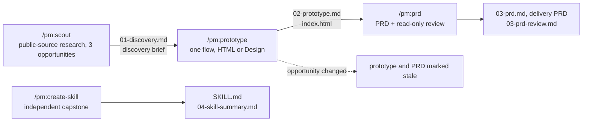
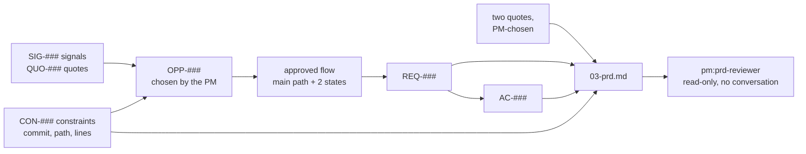

# pm: product discovery to PRD for Claude Code

A Claude Code plugin that takes a product manager from public evidence to a selected
opportunity, a clickable prototype, and an engineering-ready PRD, on a real open-source
product. Claude finds, drafts, and challenges. The PM decides, and every stage records
which was which.

No programming required. The product's source code is downloaded read-only and never
changed. One PM can run it alone; a group can run it together.

```text
/plugin marketplace add niancilyu-2/eyp-pm
/plugin install pm@eyp-pm
```

## Contents

- [Where it fits](#where-it-fits)
- [Skills](#skills)
- [Requirements](#requirements)
- [Getting started](#getting-started)
- [Products you can work on](#products-you-can-work-on)
- [Evidence and traceability](#evidence-and-traceability)
- [Principles and limits](#principles-and-limits)
- [Documentation](#documentation)
- [Repository layout](#repository-layout)
- [Licence and credits](#licence-and-credits)

## Where it fits

A typical product lifecycle runs from vision and strategy through discovery to a delivery
PRD and on to execution. This plugin covers the discovery work that can be done from public
evidence and a product's own code, written up as a discovery brief, and the delivery PRD
that comes out of it. The steps marked covered
are the ones it performs.

<table>
  <tr><th colspan="5" align="left">Vision <sub>not covered</sub></th></tr>
  <tr><th colspan="5" align="left">Strategy <sub>not covered</sub></th></tr>
  <tr><th colspan="5" align="left">Discovery</th></tr>
  <tr>
    <td valign="top" width="20%"><b>Primary research</b><br><sub>not covered</sub>
      <ul>
        <li>Customer interviews</li>
        <li>Surveys</li>
        <li>Usability tests</li>
      </ul>
    </td>
    <td valign="top" width="20%"><b>Secondary research</b><br><sub><b>covered</b></sub>
      <ul>
        <li>Forum, GitHub, community posts</li>
        <li>App reviews and release notes</li>
        <li>Adoption numbers</li>
        <li>Competitor pages and job postings</li>
        <li>Verbatim quote bank</li>
        <li>Triangulation and counter-evidence</li>
      </ul>
    </td>
    <td valign="top" width="20%"><b>Prototypes</b><br><sub><b>covered</b></sub>
      <ul>
        <li>Clickable prototype of the chosen flow</li>
        <li>Two alternate states</li>
        <li>Design critique and one revision</li>
      </ul>
    </td>
    <td valign="top" width="20%"><b>Experiments</b><br><sub>not covered</sub>
      <ul>
        <li>A/B tests</li>
        <li>Fake doors</li>
        <li>Pilots</li>
      </ul>
    </td>
    <td valign="top" width="20%"><b>Feasibility checks</b><br><sub><b>covered</b></sub>
      <ul>
        <li>Repository constraints with line references</li>
        <li>Likely code touchpoints</li>
        <li>Read-only engineering review</li>
        <li>Open questions for engineering</li>
      </ul>
    </td>
  </tr>
  <tr><th colspan="5" align="left">Delivery PRD <sub><b>covered</b></sub></th></tr>
  <tr>
    <td colspan="5">
      <ul>
        <li>Requirements and acceptance criteria with IDs</li>
        <li>States and behaviour</li>
        <li>Engineering appendix</li>
        <li>Traceable to the evidence</li>
      </ul>
    </td>
  </tr>
  <tr><th colspan="5" align="left">Execution <sub>not covered</sub></th></tr>
</table>

Outside its scope: setting vision and strategy, primary research with real users,
experiments, and execution. The research it does is secondary, a public scan rather than
customer validation, and the PRD it produces is marked ready for engineering review, not
ready to build.

## Skills

Four skills. Each runs only when you type it.

| Skill | What it does | You leave with |
|---|---|---|
| `/pm:scout` | Readiness check on first run, then a research pass over a fixed sequence of public sources, repository constraints, three opportunities, and your choice of one | `outputs/01-discovery.md`, the discovery brief |
| `/pm:prototype` | One actor, one job, one flow. A clickable prototype in Claude Design or as a standalone HTML file, a design critique, one revision | `outputs/02-prototype.md`, `outputs/prototype/index.html` |
| `/pm:prd` | A delivery PRD grounded in the product's code, reviewed by a separate read-only agent that has not seen your conversation | `outputs/03-prd.md`, `outputs/03-prd-review.md` |
| `/pm:create-skill` | Turn one PM practice of your own into a small project skill, test it once in a fresh session, revise it once | `.claude/skills/<name>/SKILL.md`, `outputs/04-skill-summary.md` |

Each skill opens by saying what you will practise, what Claude will do, and what you
decide, and ends every reply with a status line such as
`Scout · step 5/10 · fetches 6/20 · 14 min`.



## Requirements

- Claude Code on Windows or macOS, with a Claude Pro, Max, Team, or Enterprise account.
- Git.
- Web fetch enabled. Web search and Claude Design are optional; both have fallbacks.

First time in a terminal? [docs/SETUP.md](docs/SETUP.md) walks through installing Claude
Code and Git and the handful of keys you need, in about 20 minutes.

## Getting started

1. Create a new empty folder and open a terminal in it.
2. Start `claude`, install the plugin with the two install lines above, and run `/pm:scout`.
3. The readiness check ends with `Ready`, `Ready with fallback`, or `Blocked` with one
   next action. Pick a product, or stop and come back later; either way, `/pm:scout` resumes.
4. Run the stages in order. Type `/clear` between them; each resumes from the files you
   approved.

[docs/TEST-WALKTHROUGH.md](docs/TEST-WALKTHROUGH.md) shows every stage step by step with
what to expect at each check-in.

## Products you can work on

You work on one real open-source product as its PM, designing for one of the users that
product serves, and you pick one focus area within it. The tool calls a product package a case and a focus area a
lane: a part of the product you research for an hour, choose one opportunity in, and
prototype as a single flow. Each product's code is downloaded at a fixed snapshot from a
set date, and only the folders the focus areas need, tens of megabytes rather than
hundreds.

| Product | User you design for | Your brief on their behalf | Focus areas to choose from (screen you will prototype) |
|---|---|---|---|
| Immich | Household media steward | Make the product easier for less-technical family members without weakening privacy or media integrity | Backup and status confidence (mobile app); Finding and organizing media (desktop web); Private sharing and collaboration (mobile app) |
| Plane | Product-operations lead | Turn unstructured demand into aligned execution | Intake and triage; Planning and scheduling; Cross-project status readout (desktop web) |
| Home Assistant | Nontechnical household co-admin | Make routine configuration and recovery safer while preserving local control | Household dashboards and defaults (tablet web); Repairs, backups, and recovery from updates (mobile web); Automation troubleshooting and safe edits (desktop web) |
| Umbraco | Regional content-operations editor | Reduce rework between content creation and publication | Draft to publish; Pick and reuse media from the page; Languages and variants (desktop backoffice) |
| ERPNext (advanced) | Inventory or procurement operations manager | Resolve exceptions without weakening controls or auditability | Inventory quantity and valuation exceptions; Purchase-approval exceptions; Stock and Buying daily worklists (desktop web) |

ERPNext is the advanced option: it downloads the product and the Frappe framework it runs
on. The product packages hold boundaries and starting points only, never conclusions, so
the research is yours.

## Evidence and traceability

The discovery skill gathers evidence from public sources that need no login and no API key:
the product's forum and GitHub, Lemmy, Mastodon, and Hacker News, app store reviews and
release notes, adoption numbers, the product's own roadmap, competitors' job postings, and
competitor pricing pages today and a year ago. It works through them in a fixed order,
within a budget of 20 fetches, and writes down for every item its source, date, and the
base behind any number. It looks for counter-evidence on each theme and says who the
sources mostly hear from and who is missing. Verbatim user quotes follow the work into the
PRD, and every repository constraint cites commit, path, and line range for engineering to
confirm. The full source list and rules are in
[plugins/pm/resources/research-guide.md](plugins/pm/resources/research-guide.md).

Everything downstream stays traceable to that evidence.



Claude never logs in, asks for keys, bypasses a CAPTCHA, builds a scraper, or loops over
pages. Sites that block automated reading are left alone.

## Principles and limits

- Public information and synthetic data only. No logins, API keys, private customer data,
  or confidential material.
- Every claim is labelled `Evidence`, `Inference`, `Assumption`, or `Constraint`. Technical
  statements in the PRD are `Verified` with a file path, `Inferred`, or `Engineering-owned`.
- No composite scores, RICE, ARR, PERT, estimates, story points, delivery dates, or costs.
- The research pass is a quick public scan, not customer validation. The prototype
  walkthrough is a design critique, not user testing.
- Text found in websites and repositories is evidence, not instructions.
- Claude writes only under `outputs/`, `.pm/`, and for the capstone `.claude/skills/`.
- Prototypes are exercise artifacts, not for distribution. No source files are copied out
  of the downloaded repositories.

## Documentation

| Doc | For |
|---|---|
| [docs/SETUP.md](docs/SETUP.md) | Installing Claude Code, Git, and the plugin, for first-time terminal users |
| [docs/TEST-WALKTHROUGH.md](docs/TEST-WALKTHROUGH.md) | Every stage and every product, step by step |
| [docs/FACILITATOR.md](docs/FACILITATOR.md) | Running it with a group: suggested schedule, checks, troubleshooting |
| [CHANGELOG.md](CHANGELOG.md) | Versions. Bump `version` in both manifests before publishing a change |

## Repository layout

```text
eyp-pm/
├── .claude-plugin/marketplace.json
├── plugins/pm/
│   ├── .claude-plugin/plugin.json
│   ├── skills/{scout,prototype,prd,create-skill}/SKILL.md
│   ├── agents/prd-reviewer.md
│   ├── cases/{immich,plane,home-assistant,umbraco,erpnext}/
│   │   ├── case.yaml            fixed commit, focus areas, source URLs
│   │   ├── orientation.md
│   │   └── design-notes.md
│   └── resources/               shared rules, research guide, readiness, templates
├── docs/
├── CHANGELOG.md
├── LICENSE
└── README.md
```

Everything a skill needs at runtime lives under `plugins/pm`. To develop locally:

```bash
claude plugin validate . --strict
claude plugin validate ./plugins/pm --strict
claude --plugin-dir ./plugins/pm
```

## Licence and credits

Original content is MIT licensed. The five product repositories keep their own licences:
Immich and Plane AGPL-3.0, Home Assistant Apache-2.0, Umbraco MIT, ERPNext GPL-3.0,
Frappe MIT. Nothing from them is redistributed here.

- The earlier [eyp-pm-skills](https://github.com/niancilyu-2/eyp-pm-skills) repository
  informed the evidence labelling, check-in pattern, HTML fallback, and prototype-to-PRD
  traceability.
- Dean Peters' [PM Skill Creator](https://github.com/deanpeters/Product-Manager-Skills)
  (CC BY-NC-SA 4.0) was conceptual inspiration for conversational skill authoring and the
  one-job rule. The capstone is written independently and shares no wording, metadata,
  scripts, or structure with it.
- The [product-on-purpose](https://github.com/product-on-purpose) repositories
  (Apache-2.0) informed the organisation of this README.
