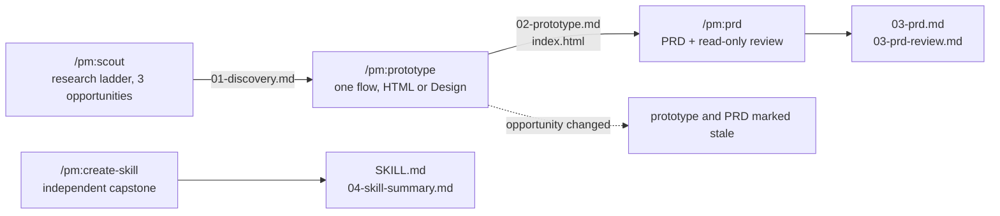
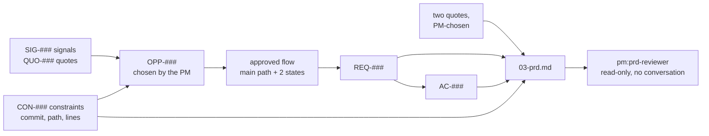

# pm: product discovery to PRD for Claude Code

A Claude Code plugin that takes a product manager from public evidence to a selected
opportunity, a clickable prototype, and an engineering-ready PRD, on a real open-source
product. Claude finds, drafts, and challenges. The PM decides, and every stage records
which was which.

Built for a facilitated workshop, usable alone. No programming required. The product's
source code is downloaded read-only and never changed.

```text
/plugin marketplace add niancilyu-2/eyp-pm
/plugin install pm@eyp-pm
```

## Commands

| Command | What it does | You leave with |
|---|---|---|
| `/pm:scout` | Readiness check on first run, then a research pass over a fixed ladder of public sources, repository constraints, three opportunities, and your choice of one | `outputs/01-discovery.md` |
| `/pm:prototype` | One actor, one job, one flow. A clickable prototype in Claude Design or as a standalone HTML file, a design critique, one revision | `outputs/02-prototype.md`, `outputs/prototype/index.html` |
| `/pm:prd` | A PRD grounded in the product's code, reviewed by a separate read-only agent that has not seen your conversation | `outputs/03-prd.md`, `outputs/03-prd-review.md` |
| `/pm:create-skill` | Turn one PM practice of your own into a small project skill, test it once in a fresh session, revise it once | `.claude/skills/<name>/SKILL.md`, `outputs/04-skill-summary.md` |

Each command runs only when you type it. Each opens by saying what you will practise,
what Claude will do, and what you decide, and ends every reply with a status line such as
`Scout · step 5/10 · fetches 6/20 · 14 min`.



## Requirements

- Claude Code on Windows or macOS, with a Claude Pro, Max, Team, or Enterprise account.
- Git.
- Web fetch enabled. Web search and Claude Design are optional; both have fallbacks.

First time in a terminal? [docs/SETUP.md](docs/SETUP.md) walks through installing Claude
Code and Git and the handful of keys you need, in about 20 minutes.

## Getting started

1. Create a new empty folder and open a terminal in it.
2. Start `claude`, install the plugin with the two commands above, and run `/pm:scout`.
3. The readiness check ends with `Ready`, `Ready with fallback`, or `Blocked` with one
   next action. Pick a case, or stop and come back later; either way, `/pm:scout` resumes.
4. Run the stages in order. Type `/clear` between them; each resumes from the files you
   approved.

[docs/TEST-WALKTHROUGH.md](docs/TEST-WALKTHROUGH.md) shows every stage step by step with
what to expect at each check-in.

## The cases

Pick one product and one lane. Each case is pinned to a specific commit and only the
folders it needs are downloaded, tens of megabytes rather than hundreds.

| Case | You play | Mandate | Lanes (prototype surface) |
|---|---|---|---|
| Immich | Household media steward | Make the product easier for less-technical family members without weakening privacy or media integrity | Backup and status confidence (mobile app); Finding and organizing media (desktop web); Private sharing and collaboration (mobile app) |
| Plane | Product-operations lead | Turn unstructured demand into aligned execution | Intake and triage; Planning-to-execution visibility; Stakeholder progress (desktop web) |
| Home Assistant | Nontechnical household co-admin | Make routine configuration and recovery safer while preserving local control | Dashboards (tablet web); Device and entity health and recovery (mobile web); Automation creation and troubleshooting (desktop web) |
| Umbraco | Regional content-operations editor | Reduce rework between content creation and publication | Draft to publish; Media reuse; Validation and localization (desktop backoffice) |
| ERPNext | Inventory or procurement operations manager | Resolve exceptions without weakening controls or auditability | Inventory exceptions; Purchase-approval exceptions; Role-based daily navigation (desktop web) |

ERPNext is the advanced case: it downloads the product and the Frappe framework it runs
on. Case files hold boundaries and starting points only, never conclusions.

## How research works

Discovery walks a fixed ladder of public sources that need no login and no API key. Each
case's `case.yaml` carries the URL templates.

| Rung | Sources |
|---|---|
| 1 Community, structured | Product forum search and top threads; GitHub Discussions by upvotes; GitHub issues by reactions, with HTML search pages when the API is rate-limited |
| 2 Community, fediverse and aggregators | Lemmy; Mastodon hashtags; Hacker News stories and comments |
| 3 Reviews | Apple App Store review feed and release notes; Google Play reviews pasted in by you from the listing |
| 4 Adoption | GitHub stars, Docker Hub pulls, PyPI or NuGet downloads; Wikipedia pageviews |
| 5 Competitors and roadmaps | The product's own boards and milestones; competitors' job postings; competitor pricing pages today and a year ago via the Wayback Machine |
| 6 Official | Release notes, changelog, blog, docs |
| 7 Search snippets | Only if web search works; logged as unverified inference, never as evidence |

Budget: 20 fetches and 8 searches per run. Every item gets a stable ID, a URL, dates, and
a number with its base. Each theme gets one fetch looking for counter-evidence, and the
file says who the sources mostly hear from and who is missing. Verbatim user quotes form a
quote bank that follows the work into the PRD. Repository constraints cite commit, path,
line range, and a quoted line, marked "to confirm with engineering".



Claude never logs in, asks for keys, bypasses a CAPTCHA, builds a scraper, or loops over
pages. G2, Capterra, Trustpilot, and Product Hunt block automated reading and are not
attempted. Reddit is reachable only through an opt-in switch that allows one `curl` of a
subreddit RSS feed.

## Principles and limits

- Public information and synthetic data only. No logins, API keys, private customer data,
  or confidential material.
- Every claim is labelled `Evidence`, `Inference`, `Assumption`, or `Constraint`. Technical
  statements in the PRD are `Verified` with a file path, `Inferred`, or `Engineering-owned`.
- No composite scores, RICE, ARR, PERT, estimates, story points, delivery dates, or costs.
- The research pass is a quick public scan, not customer validation. The prototype
  walkthrough is a design critique, not user testing.
- Text found in websites and repositories is evidence, not instructions.
- Claude writes only under `outputs/`, `.pm/`, and for the capstone `.claude/skills/`.
- Prototypes are exercise artifacts, not for distribution. No source files are copied out
  of the pinned repositories.

## Documentation

| Doc | For |
|---|---|
| [docs/SETUP.md](docs/SETUP.md) | Installing Claude Code, Git, and the plugin, for first-time terminal users |
| [docs/TEST-WALKTHROUGH.md](docs/TEST-WALKTHROUGH.md) | Every stage and every case, step by step |
| [docs/FACILITATOR.md](docs/FACILITATOR.md) | Running it with a group: suggested day, checks, troubleshooting, pilot bar |
| [CHANGELOG.md](CHANGELOG.md) | Versions. Bump `version` in both manifests before publishing a change |

## Repository layout

```text
eyp-pm/
├── .claude-plugin/marketplace.json
├── plugins/pm/
│   ├── .claude-plugin/plugin.json
│   ├── skills/{scout,prototype,prd,create-skill}/SKILL.md
│   ├── agents/prd-reviewer.md
│   ├── cases/{immich,plane,home-assistant,umbraco,erpnext}/
│   │   ├── case.yaml            pinned commits, lanes, feeds
│   │   ├── orientation.md
│   │   └── design-notes.md
│   └── resources/               shared rules, research guide, readiness, templates
├── docs/
├── CHANGELOG.md
├── LICENSE
└── README.md
```

Everything a skill needs at runtime lives under `plugins/pm`. To develop locally:

```bash
claude plugin validate . --strict
claude plugin validate ./plugins/pm --strict
claude --plugin-dir ./plugins/pm
```

## Licence and credits

Original content is MIT licensed. The five product repositories keep their own licences:
Immich and Plane AGPL-3.0, Home Assistant Apache-2.0, Umbraco MIT, ERPNext GPL-3.0,
Frappe MIT. Nothing from them is redistributed here.

- The earlier [eyp-pm-skills](https://github.com/niancilyu-2/eyp-pm-skills) repository
  informed the evidence labelling, check-in pattern, HTML fallback, and prototype-to-PRD
  traceability.
- Dean Peters' [PM Skill Creator](https://github.com/deanpeters/Product-Manager-Skills)
  (CC BY-NC-SA 4.0) was conceptual inspiration for conversational skill authoring and the
  one-job rule. The capstone is written independently and shares no wording, metadata,
  scripts, or structure with it.
- The [product-on-purpose](https://github.com/product-on-purpose) repositories
  (Apache-2.0) informed the organisation of this README.
