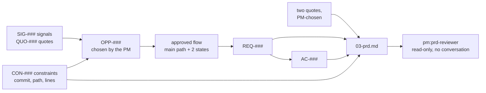

# /pm:prd

The delivery PRD skill. It turns the approved discovery brief and prototype into an
engineering handoff grounded in the product's code, and has a separate read-only agent
review it before you sign it off.

## What it produces

`outputs/03-prd.md`, the delivery PRD, with status `ready-for-engineering-review`, and
`outputs/03-prd-review.md`, the independent review with each finding and how you settled
it.

## Before you start

Both the discovery brief and the prototype must be approved and current. If either is
missing or stale, the skill stops and says which one to rerun.

## How a run goes

1. **Find the code that would change.** Starting from the focus area's entry points and
   the prototype's references, Claude locates the UI, state, permission, and API code most
   likely involved. Anything it opened is `Verified` with a path. Anything it did not open
   is `Inferred`. It reopens every constraint from the discovery brief at its cited line
   range before labelling anything verified.
2. **Draft the PRD.** Problem and evidence with two customer quotes, goals and non-goals,
   the approved flow and states, requirements with IDs, acceptance criteria with IDs, state
   behaviour, success measures, quality needs, rollout considerations, risks and open
   questions, the decision record, and an engineering appendix.
3. **Scope check-in**, in two short turns. First the problem, quotes, goals, and non-goals.
   Then behaviour, states, and acceptance criteria as yes or no items. You approve or edit,
   and you pick which two quotes go in.
4. **Independent review.** Claude sends the files, the code paths, and a checklist to a
   reviewer agent that has not seen the conversation and can only read. It checks
   traceability, unsupported technical claims, quote provenance, missing states or
   permissions, untestable criteria, scope conflicts, delivery risks, and blocking open
   questions.
5. **Settle each finding.** Blocking ones first. Fix it in the PRD, turn it into a
   nonblocking engineering question, or accept it with a note. A blocking finding cannot be
   deferred.
6. **Handoff check-in.** You approve the dispositions and confirm the open product
   questions.
7. **Save.** PRD and review written, session updated.

## Traceability

Everything in the PRD points back to something earlier.

## Rules it follows

- Technical statements are `Verified` with a path, `Inferred`, or `Engineering-owned`.
  Architecture, implementation design, and estimates are engineering's.
- No estimates, story points, delivery dates, or costs anywhere.
- A question may stay open for engineering only if answering it would not change scope,
  user behaviour, data or security behaviour, or acceptance criteria.
- Every constraint keeps "to confirm with engineering" until an engineer signs it off.
- Every reply ends with a status line: step, requirement and criteria counts, findings,
  minutes, source folder status.

## Where the details live

`plugins/pm/skills/prd/SKILL.md` is the skill, `plugins/pm/agents/prd-reviewer.md` the
reviewer, `plugins/pm/resources/prd-review-checklist.md` what it checks, and
`plugins/pm/resources/templates/03-prd.md` the PRD template.
